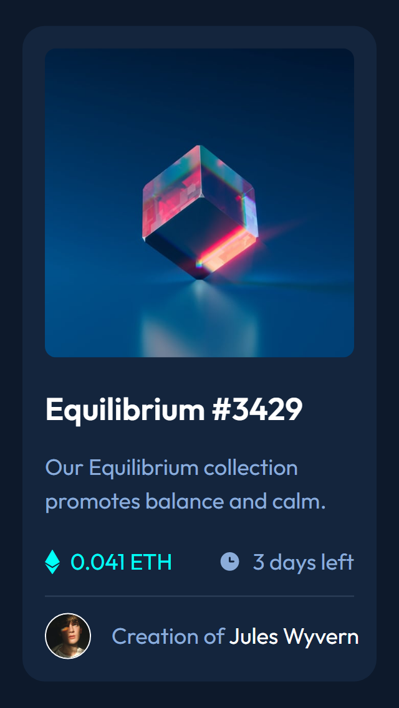

# Frontend Mentor - NFT preview card component solution

This is a solution to the [NFT preview card component challenge on Frontend Mentor](https://www.frontendmentor.io/challenges/nft-preview-card-component-SbdUL_w0U). Frontend Mentor challenges help you improve your coding skills by building realistic projects. 

## Table of contents

- [Overview](#overview)
  - [The challenge](#the-challenge)
  - [Screenshot](#screenshot)
  - [Links](#links)
- [My process](#my-process)
  - [Built with](#built-with)
  - [What I learned](#what-i-learned)
  - [Continued development](#continued-development)
  - [Useful resources](#useful-resources)
- [Author](#author)
- [Acknowledgments](#acknowledgments)

**Note: Delete this note and update the table of contents based on what sections you keep.**

## Overview

### The challenge

Users should be able to:

- View the optimal layout depending on their device's screen size
- See hover states for interactive elements

### Screenshot



### Links

- Solution URL: [Add solution URL here](https://your-solution-url.com)
- Live Site URL: [Add live site URL here](https://your-live-site-url.com)

## My process

### Built with

- Semantic HTML5 markup
- CSS table display
- Mobile-first workflow
- Google Fonts

### What I learned

``` mix-blend-mode ``` is used to mix the images or the background colors of two elements which are on top of each other.

``` white-space ``` can be used to force the content to fit into a single line by preventing line breaks.

``` font-style: normal; ``` removes italic formats from text

### Continued development

- Blending two images or two background colors is something I still need to practice.

### Useful resources

- [https://tinyurl.com/yefwh8nb] - comment by @Lucas

## Author

- Frontend Mentor - [@ozanweb](https://www.frontendmentor.io/profile/ozanweb)
- LinkedIn - [@ozanpalanci](https://www.linkedin.com/in/ozanpalanci/)

## Acknowledgments

Lucas @ frontendmentor.io

